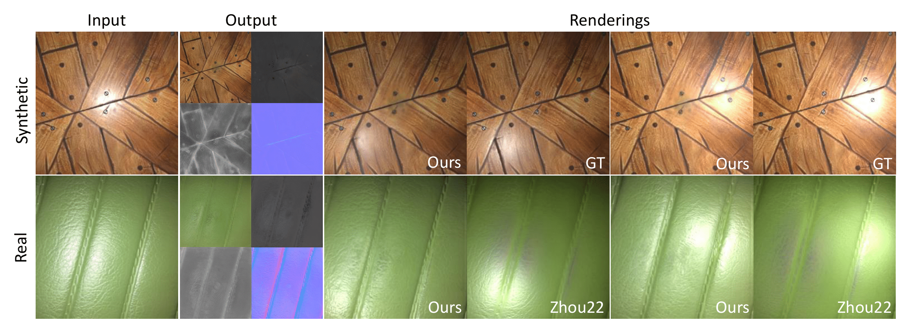

# Single-Image-SVBRDF-Estimation-with-Learned-Gradient-Descent
This is code of "Single-Image SVBRDF Estimation with Learned Gradient Descent" 
[Paper](http://graphics.tudelft.nl/Publications-new/2024/LSBE24)



## Requirements

To install the environment, please run this command below:

```
conda list -e > requirements.txt
```

## Inference

Before running inference, please download our pretrained model from this [link](https://drive.google.com/file/d/1FfRznuTmqrKvNyzuAwL6CPrAzz2J38qK/view?usp=drive_link) 

please save the pretrained model to `./ckpt/` and put your testing data to `./dataset`.

To run the inference code, use this command:

```
python predict.py --useLog --correctGamma

```
The output SVBRDF is stored in the order: diffuse, specular, roughness, normal.
(Diffuse and specular are in srgb color space (gamma 2.2), other maps are in linear color space)

## Training
If you would like to retrain the model, please use the train.py file with your own dataset. Make sure that the input image and the maps are all stored in linear color space.
After you set up the training and testing data paths, use this commands to run the code:

```
python train.py -b 1 -v 20 --useLog --epochs 200

```

## Citation
If you use our code or pretrained models, please cite as following:

```


```


## Contact
Feel free to contact me if you have any questions: luoluoxj@gmail.com. 
